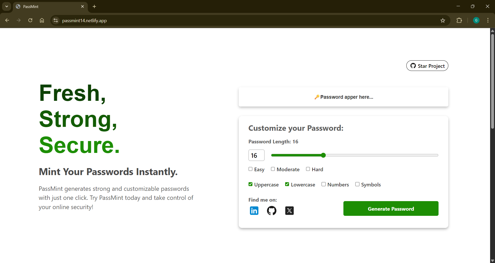

# 🔑 PassMint

Fresh, Strong, Secure – **Mint Your Passwords Instantly.**  
PassMint is a mini React project that generates strong and customizable passwords with a modern UI.  
Built to practice React concepts and provide a handy tool for anyone who values online security.  

---

## 🌟 Features

- ✅ Customize password length (up to 50 characters)  
- 🔢 Option to include numbers, symbols, uppercase, and lowercase letters  
- ⚡ One-click copy to clipboard  
- 🛡️ Choose mode (Easy, Moderate, Hard)  
- 📱 Responsive design – works on mobile and desktop  

---

## 📸 Screenshots

_Add your screenshots here (after you build UI). Example:_  



---

## 🚀 Live Demo

👉 [Try PassMint on Netlify](https://passmint14.netlify.app/)  

---

## 🛠️ Installation & Setup

Follow these steps to run PassMint locally:  

1. **Clone the repository**
   ```bash
   git clone https://github.com/gauravGunjal14/PassMint.git
   cd PassMint

2. **Install dependencies and Run the development server**
   ```bash
   npm install
   npm run dev

3. **Open your browser at:**
   ```bash
    http://localhost:1234
---
