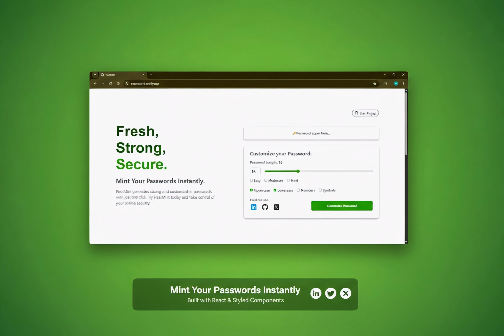

# 🔑 PassMint

Fresh, Strong, Secure – **Mint Your Passwords Instantly.**
PassMint is a mini React project that generates strong and customizable passwords with a modern UI.
Built to practice React concepts and provide a handy tool for anyone who values online security.

---

## 🌟 Features

* ✅ Customize password length (up to 50 characters)
* 🔢 Option to include numbers, symbols, uppercase, and lowercase letters
* ⚡ One-click copy to clipboard
* 🛡️ Choose mode of password(Easy, Moderate, Hard)
* 📱 Responsive design – works on mobile and desktop

---

## 📸 Screenshots



---

## 🚀 Live Demo

👉 [Try PassMint on Netlify](https://passmint14.netlify.app/)

---

## 🛠️ Installation & Setup

Follow these steps to run PassMint locally:

1. **Clone the repository**

   ```bash
   git clone https://github.com/gauravGunjal14/PassMint.git
   cd PassMint
   ```

2. **Install dependencies**

   ```bash
   npm install
   ```

3. **Run the development server**

   ```bash
   npm run dev
   ```

4. **Open your browser at**

   ```
   http://localhost:1234
   ```

---

## 📂 Project Structure

```bash
PassMint/
│── public/            # Static files
│── src/
│   ├── Component/
│   │   ├── Hero.js
│   │   ├── PasswordGenerator.js
│   │   ├── App.js
│   │   ├── Features.js
│   │   ├── About.js
│   │   ├── Footer.js
│   ├── style.css
│   ├── main.js
│── index.html         # Entry point
│── package-lock.json
│── package.json
│── README.md
```

---

## 👨‍💻 About Me

Hi, I’m **Gaurav** 👋
An IT student passionate about web development and building practical tools with modern technologies.
This project was built to practice React and share something useful with others.

🔗 Find me here:

* [GitHub](https://github.com/gauravGunjal14)
* [LinkedIn](https://www.linkedin.com/in/gaurav-gunjal14/)
* [X](https://x.com/gaurav_gunjal14)

---

## 📜 License

This project is open-source and available under the **MIT License**.
